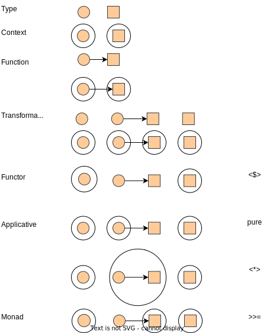

# learning-haskell
Playground of Haskell.

## Actions

- [Examples in 'Get Programming with Haskell'](./get-programming-with-haskell/README.md)
- [Examples in 'Effective Haskell'](./effective-haskell/README.md)
- [Examples in 'Developing Web Apps with Haskell and Yesod'](./learn-yesod/README.md)

## Graphs

- Context in Types

## TODOs

- Library document: `Prelude` in GHC-9.4.8, GHC langauge extensions, etc.
- [x] Testing framework: QuickCheck.
- Application configuration: YAML, JSON, etc.
- Database libraries: MySQL, PostgreSQL, etc.
- Message Broker libraries: Kafka etc.
- Web framework: Yesod.
- Build tools configuration: cabal, stack.
